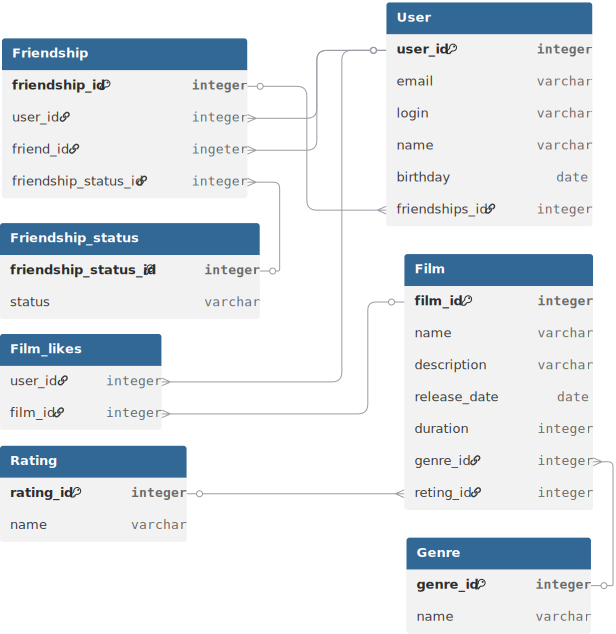

# java-filmorate
Template repository for Filmorate project.

## Схема базы данных


### Примеры SQL-запросов для основных операций

#### 1. Получение топ-N популярных фильмов (по количеству лайков)
```sql
SELECT f.id, f.name, COUNT(fl.user_id) AS likes_count
FROM film f
LEFT JOIN film_like fl ON f.id = fl.film_id
GROUP BY f.id
ORDER BY likes_count DESC
LIMIT 10;
```

#### 2. Получение списка подтверждённых друзей пользователя
```sql
SELECT u.*
FROM user u
WHERE u.id IN (
    SELECT friend_id FROM friendship WHERE user_id = 1 AND friendship_status_id = 2
    UNION
    SELECT user_id FROM friendship WHERE friend_id = 1 AND friendship_status_id = 2
);
```
!!!
#### 3. Получение общих друзей двух пользователей
```sql
SELECT DISTINCT u.*
FROM friendship f1
JOIN friendship f2 ON f1.friend_id = f2.friend_id
JOIN user u ON u.id = f1.friend_id
WHERE f1.user_id = 1
  AND f2.user_id = 2
  AND f1.friendship_status_id = (SELECT id FROM friendship_status WHERE status = 'CONFIRMED')
  AND f2.friendship_status_id = (SELECT id FROM friendship_status WHERE status = 'CONFIRMED');
```

#### 4. Получение всех фильмов с их жанрами
```sql
SELECT f.id, f.name, g.name AS genre
FROM film f
LEFT JOIN film_genre fg ON f.id = fg.film_id
LEFT JOIN genre g ON fg.genre_id = g.id;
```